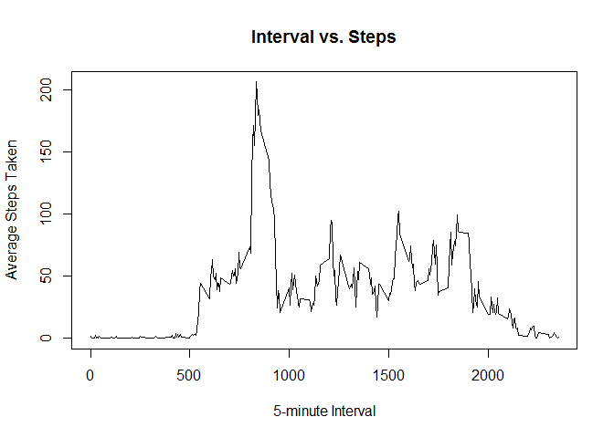
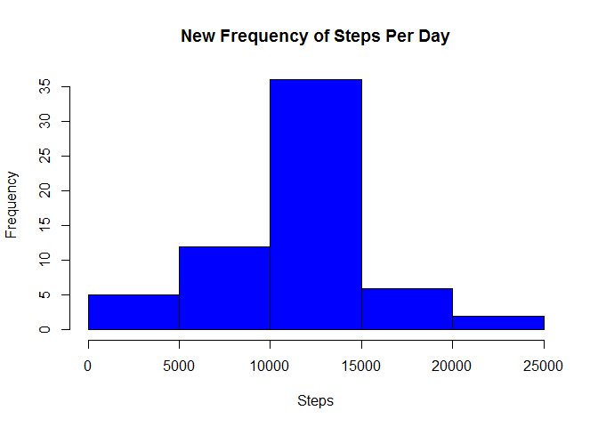
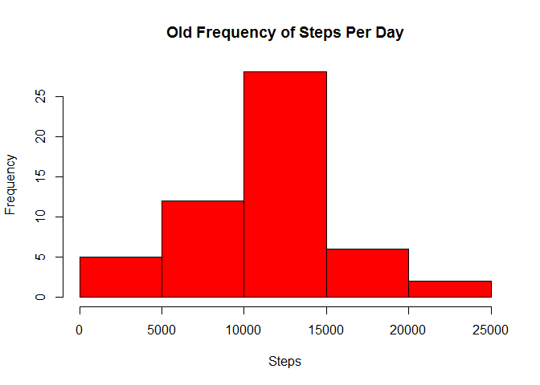

# PA1_template.Rmd
BWetz  
June 11, 2017  

## R Markdown

Data for this assignment was downloaded from https://d396qusza40orc.cloudfront.net/repdata%2Fdata%2Factivity.zip and saved to the working directory.

First, load the dplyr package, then read the data into R and omit NA readings:


```r
library(dplyr)
```

```
## 
## Attaching package: 'dplyr'
```

```
## The following objects are masked from 'package:stats':
## 
##     filter, lag
```

```
## The following objects are masked from 'package:base':
## 
##     intersect, setdiff, setequal, union
```


```r
setwd("~/Coursera/Data Science Certification/5 Reproducible Research/repdata_data_activity")
data<-read.csv("activity.csv",na.strings="NA")
omitNAdata<-na.omit(data)
```

1. What is the mean total number of steps taken per day?

To answer, the total number of steps taken per day was calculated and plotted as a histogram:


```r
allsteps<-aggregate(steps~date,omitNAdata,sum)

hist(allsteps$steps, col="red", main="Frequency of Steps Per Day", xlab="Steps")
```

<!-- -->

The mean and median total number of steps taken per day are as follows:


```r
meansteps<-mean(allsteps$steps)
meansteps
```

```
## [1] 10766.19
```

```r
mediansteps<-median(allsteps$steps)
mediansteps
```

```
## [1] 10765
```

2. What is the average daily activity pattern?

A time series plot of the average number of steps versus the 5-minute interval data shows the following pattern:


```r
intervalsteps<-aggregate(steps~interval,omitNAdata,mean)

plot(intervalsteps$interval,intervalsteps$steps,type="l", xlab="5-minute Interval", ylab="Average Steps Taken", main="Interval vs. Steps")
```

<!-- -->

The 5-minute interval, on average across all the days in the dataset, that contains the maximum number of steps is:


```r
maxinterval<-intervalsteps[which.max(intervalsteps$steps),1]
maxinterval
```

```
## [1] 835
```

3. Inputing missing values

There are a number of days/intervals where there are missing values, coded as NA. These NA values may introduce some bias into some calculations or summaries of the data.

The total number of missing values in the dataset is:


```r
setwd("~/Coursera/Data Science Certification/5 Reproducible Research/repdata_data_activity")
datawithNA<-read.csv("activity.csv")

numNAs<-length(which(is.na(datawithNA)))
numNAs
```

```
## [1] 2304
```

Since we have already calculated the average number of steps per 5-minute interval, we can use this data to fill in the missing values.


```r
replaceNAs<-data %>% mutate(steps=replace(steps,is.na(steps),intervalsteps$steps))
```

Now we can create a new histgram that includes the replaced missing data to compare to the first histogram which omitted missing values.


```r
newallsteps<-aggregate(steps~date,replaceNAs,sum)
hist(newallsteps$steps, col="blue", main="New Frequency of Steps Per Day", xlab="Steps")
```

<!-- -->

```r
hist(allsteps$steps, col="red", main="Old Frequency of Steps Per Day", xlab="Steps")
```

<!-- -->

Recalculating the mean and median values from question 1, we can see the values are identical.


```r
meannewsteps<-mean(newallsteps$steps)
meannewsteps
```

```
## [1] 10766.19
```

```r
mediannewsteps<-median(newallsteps$steps)
mediannewsteps
```

```
## [1] 10766.19
```

4. Are there differences in activity patterns between weekdays and weekends?

To answer this question we need to annotate our data with weekdays (Monday through Friday) and weekends (Saturday and Sunday). To graph our new data, the name of the week must be a factor.


```r
replaceNAs$date<-as.Date(replaceNAs$date)
replaceNAs<-replaceNAs %>% mutate(weekname = ifelse(weekdays(replaceNAs$date)=="Saturday"|weekdays(replaceNAs$date)=="Sunday","weekend","weekday"))

replaceNAs$weekname<-as.factor(replaceNAs$weekname)
```

Now we can compare average steps per 5-minute interval between weekdays and weekends.


```r
weekintervalsteps<-replaceNAs %>% group_by(interval,weekname) %>% summarize(steps=mean(steps))

library(lattice)

xyplot(steps~interval|factor(weekname),data=weekintervalsteps,type="l", layout=c(1,2))
```

<!-- -->

Users tend to get more steps on the weekends when compared to the weekdays.
